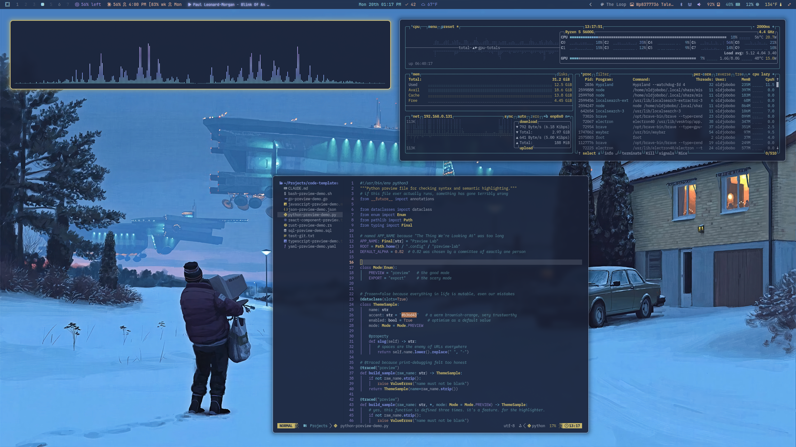
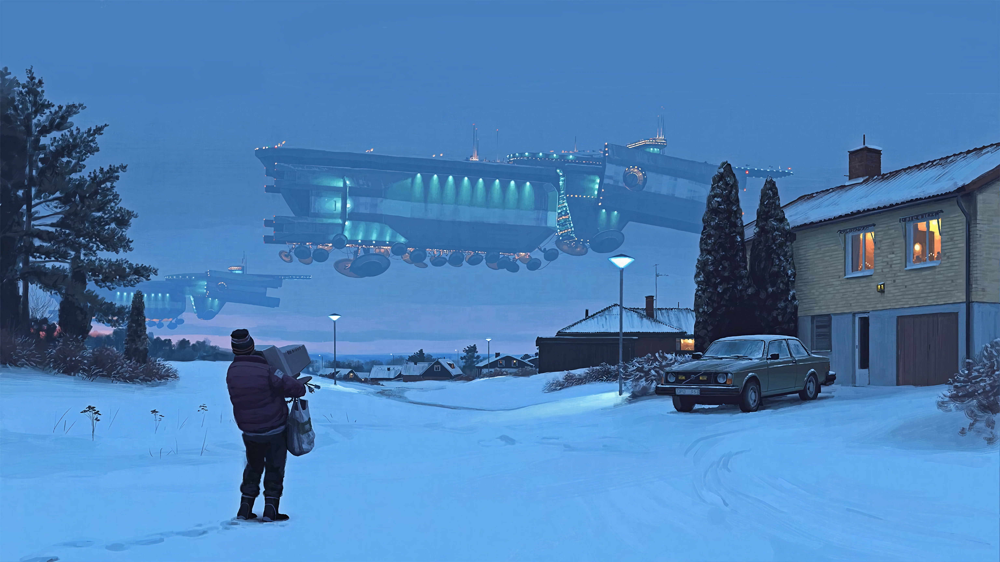

# Omarchy The Loop Theme

Cold blue dusk, yellow instrument glow, and just enough retro-future machinery to make the desktop feel like it belongs somewhere north of ordinary. The Loop is a dark Omarchy theme built around muted steel blues, lifted cool neutrals, and a restrained amber accent pulled from *Tales from the Loop*.

## Preview



## Install

Use the Omarchy theme installer:

```bash
omarchy-theme-install https://github.com/OldJobobo/omarchy-the-loop-theme
```

## What's Included

- Core Omarchy theme coverage for Hyprland, Hyprlock, Waybar, notifications, launchers, and GTK/Aether surfaces
- Terminal themes for Foot, Kitty, Ghostty, Alacritty, Warp, and btop
- A bundled Base24 palette in `the-loop-base24.yaml`
- VS Code mapping to `Tokyo Night Storm`, the closest packaged editor theme to the desktop palette

## Wallpapers

<table>
  <tr>
    <td></td>
    <td></td>
    <td></td>
  </tr>
  <tr>
    <td></td>
    <td></td>
    <td></td>
  </tr>
</table>

## Requirements

- `Yaru-yellow` for icons, as configured in `icons.theme`

## Notes

- The terminal palette is tuned for light translucency and ships with a consistent `0.90` opacity across Foot, Kitty, Ghostty, and Alacritty
- The repo includes a `foot.ini` alongside the usual Omarchy terminal configs
- `vscode.json` points to `enkia.tokyo-night` with the `Tokyo Night Storm` theme name rather than a fully custom editor theme

## Attribution

- Wallpaper art is sourced from *Tales from the Loop* wallpaper sets and then theme-tuned for this repo
